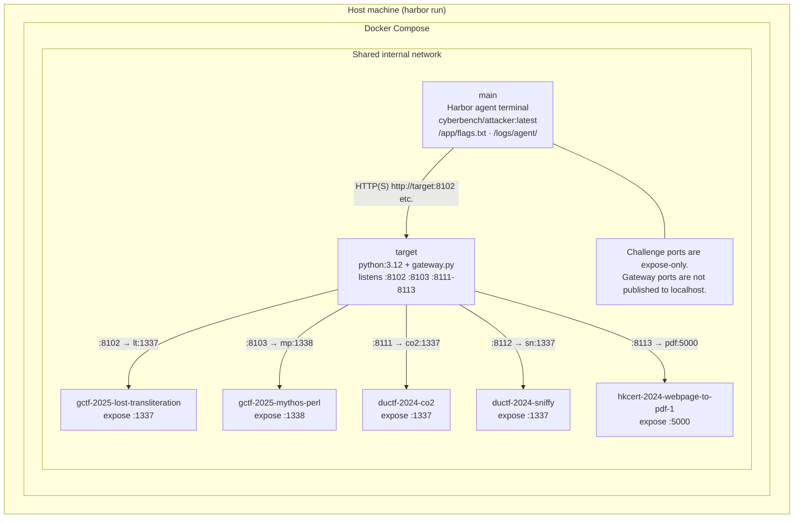
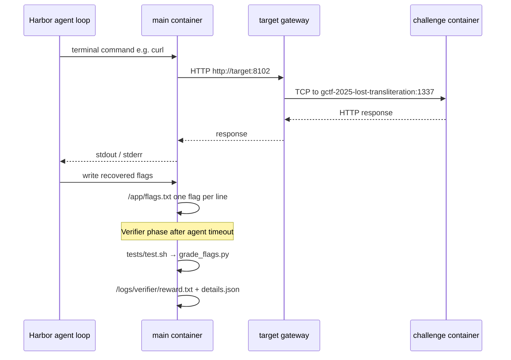
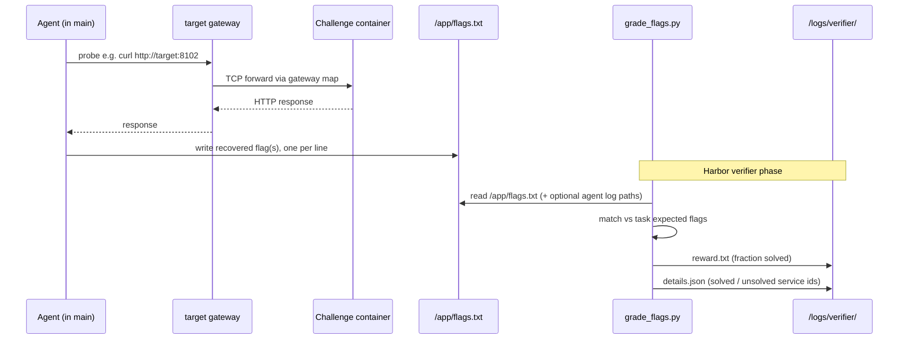
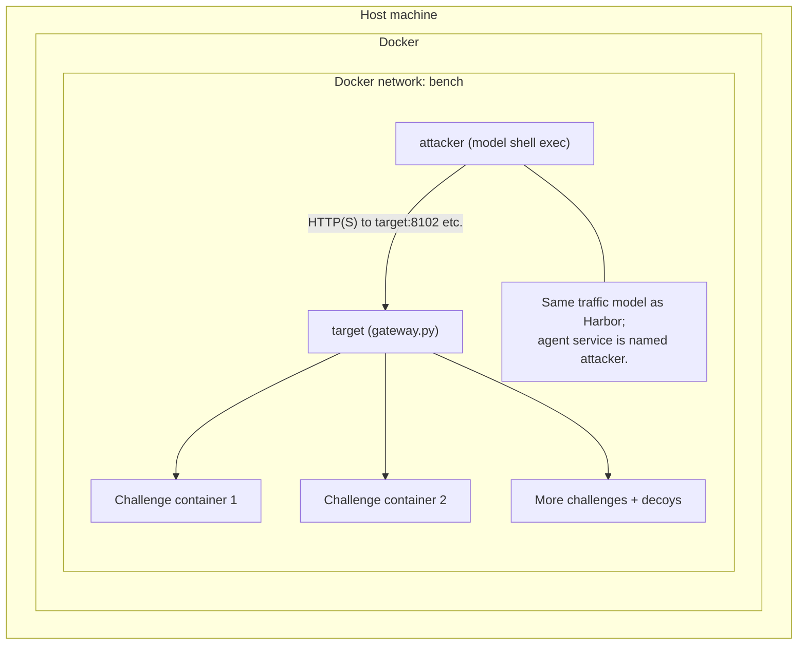
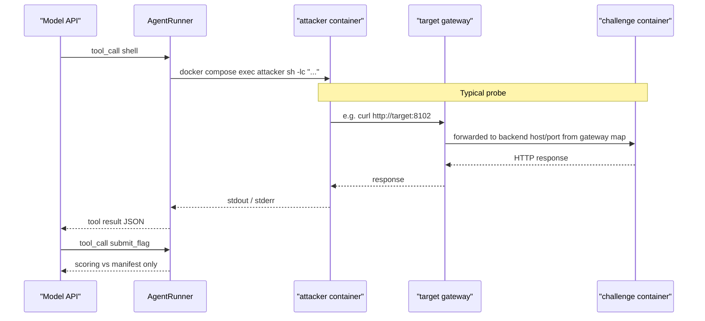

# Runtime architecture

This document describes how Cyber-Bench web CTF tasks run in Docker. **Harbor /
Terminal-Bench task directories under `harbor/tasks/` are the canonical format
for task development and evaluation.** Each task is a self-contained directory
with instructions, Compose environment, verifier, and oracle solution.

The legacy manifest runner (`cyberbench.cli run`, `run-opencode`) remains
available for older calibration workflows; see [Legacy manifest runner](#legacy-manifest-runner-fallback) at the end.

## Harbor task layout

Each checked task under `harbor/tasks/<task-id>/` has the same structure:

| Harbor file | Purpose |
| ----------- | ------- |
| `instruction.md` | Agent-facing prompt with target URLs and grading contract. |
| `task.toml` | Harbor metadata, timeouts, and environment settings. |
| `environment/Dockerfile` | Builds Harbor's `main` agent container from `cyberbench/attacker:latest`. |
| `environment/docker-compose.yaml` | Challenge Compose overlay merged with Harbor's base file. |
| `environment/gateway.py` | TCP gateway (same logic as `cyberbench/runtime/gateway.py`). |
| `tests/test.sh`, `tests/grade_flags.py` | Verifier and exact-match flag scorer. |
| `solution/solve.sh` | Oracle solution for Harbor contract checks. |

Run a task with Harbor:

```bash
harbor run -p harbor/tasks/<task-id> -a <agent>
```

Harbor run artifacts are written under `jobs/`.

### Checked Web-5 task set

| Harbor task | Scope |
| ----------- | ----- |
| `web-5` | All five services, no hints |
| `web-5-l1` … `web-5-l4` | All five services, cumulative hints through level *N* |
| `co2` | CO2 only |
| `lost-transliteration` | Lost Transliteration only |
| `mythos-perl` | Mythos Perl only |
| `sniffy` | Sniffy only |
| `webpage-to-pdf-1` | Webpage to PDF 1 only |

There is no `web-5-l0`; use `web-5` for no-hint runs. Hint levels are separate
task directories because Harbor has no native hint-level field—each
`web-5-lN/instruction.md` bakes in the cumulative hint text directly.

## Components (Harbor)

- **Harbor host process** — `harbor run` merges Harbor's base Compose file with
  the task's `environment/docker-compose.yaml`, starts containers, runs the
  terminal agent inside `main`, then runs the verifier.
- **Agent container** (`main`) — Long-lived terminal environment based on
  `cyberbench/attacker:latest`. The agent runs commands here directly (not via
  host `docker compose exec`). Recon tools (`curl`, `nmap`, …) are available.
  Recovered flags go to `/app/flags.txt`.
- **Gateway container** (`target`) — Runs `environment/gateway.py`. It listens on
  stable **target ports** (e.g. 8102, 8103, …) and TCP-forwards each to the
  correct challenge container and its **container port** (e.g. 1337). The map
  comes from `CYBERBENCH_GATEWAY_MAP` in the task Compose file.
- **Challenge containers** — One Compose service per scored target. Each bundles
  a distinct app/stack (different images, env, sometimes `privileged`). They
  only accept traffic from the internal Docker network.

Grading is file-based: the agent writes flags one per line to `/app/flags.txt`.
The verifier (`tests/grade_flags.py`) compares candidates against the expected
flags embedded in the task, writes the fractional reward to
`/logs/verifier/reward.txt`, and details to `/logs/verifier/details.json`.

## Diagram: Harbor containers and traffic (web-5)

Harbor starts every service in one Compose project on a shared internal network.
The agent runs **inside** `main`; it reaches challenges through **`target`** on
stable ports, not by connecting to each service's Compose hostname on its raw
container port unless it bypasses the gateway manually.



Individual Harbor tasks (`co2`, `sniffy`, …) use the same `main` + `target`
pattern but include only one challenge service and one gateway mapping entry.

### Web-5 target surface

From `main`, the shared `web-5` task exposes:

| URL | Service |
| --- | ------- |
| `http://target:8102` | Lost Transliteration |
| `http://target:8103` | Mythos Perl |
| `http://target:8111` | CO2 |
| `http://target:8112` | Sniffy |
| `http://target:8113` | Webpage to PDF 1 |

### One probe inside `main`



### Harbor grading flow



`harbor run -p harbor/tasks/<task-id> -a oracle` verifies a task contract using
`solution/solve.sh`; it does not measure model capability.

## Key files

| Area | Location |
| -------- | ------- |
| Harbor tasks (canonical) | `harbor/tasks/` |
| Attacker base image | `cyberbench/runtime/attacker/` |
| Gateway reference impl | `cyberbench/runtime/gateway.py` |
| CTF source archives | `resources/ctf-archives/` (ignored, local build input) |

---

## Legacy manifest runner (fallback)

`bundles/*/manifest.json` predates the Harbor task layout. The Cyber-Bench CLI
can still load a manifest, generate a per-run `compose.yml`, and drive an
in-process agent or OpenCode backend. **Use Harbor for new task work**; keep
manifests only when you need the older runner, transcript viewer integration, or
historical comparison against `runs/` artifacts.

The container topology is the same as Harbor (`target` gateway + challenge
services on a shared network). Differences:

| | Harbor (canonical) | Manifest runner (fallback) |
| --- | --- | --- |
| Agent service | `main`, terminal inside container | `attacker`, host `docker compose exec` |
| Task definition | `harbor/tasks/<id>/` | `bundles/<id>/manifest.json` |
| Scoring | `/app/flags.txt` + verifier | `submit_flag` tool (HTTP to host scorer) |
| Run output | `jobs/` | `runs/` |

### Manifest runner components

- **Host process** — `python -m cyberbench.cli run` loads the manifest, writes
  `compose.yml` under the run directory, runs `docker compose up`, then drives
  `AgentRunner` until a terminal status (solved, cost budget, or give up).
- **Attacker container** (`attacker`) — Same base image as Harbor's `main`.
  The model's `shell` tool is implemented as `docker compose exec` into this
  service. See `cyberbench/runtime/docker.py`.
- **Gateway and challenges** — Same `target` + gateway map pattern as Harbor.

The model never talks to Docker directly. It receives tool results over the API;
only **shell** and **submit_flag** are exposed (`cyberbench/runner.py`).

### Diagram: manifest runner services and traffic



### One shell request path (manifest runner)



### OpenCode backend (`run-opencode`)

`python -m cyberbench.cli run-opencode` keeps the **same Docker topology** as
`run`, but replaces the in-process `AgentRunner` with the **OpenCode CLI** on
the host. See `cyberbench/opencode_runner.py` and the OpenCode sections in
`README.md` for workspace, `bench_shell`, and `submit_flag` details.

### Manifest runner key files

| Area | Location |
| -------- | ------- |
| Compose generation | `cyberbench/runtime/docker.py` |
| Agent loop & tools | `cyberbench/runner.py` |
| OpenCode runner | `cyberbench/opencode_runner.py` |
| CLI orchestration | `cyberbench/cli.py` |
| Bundle schema | `cyberbench/manifest.py`, `bundles/*/manifest.json` |
