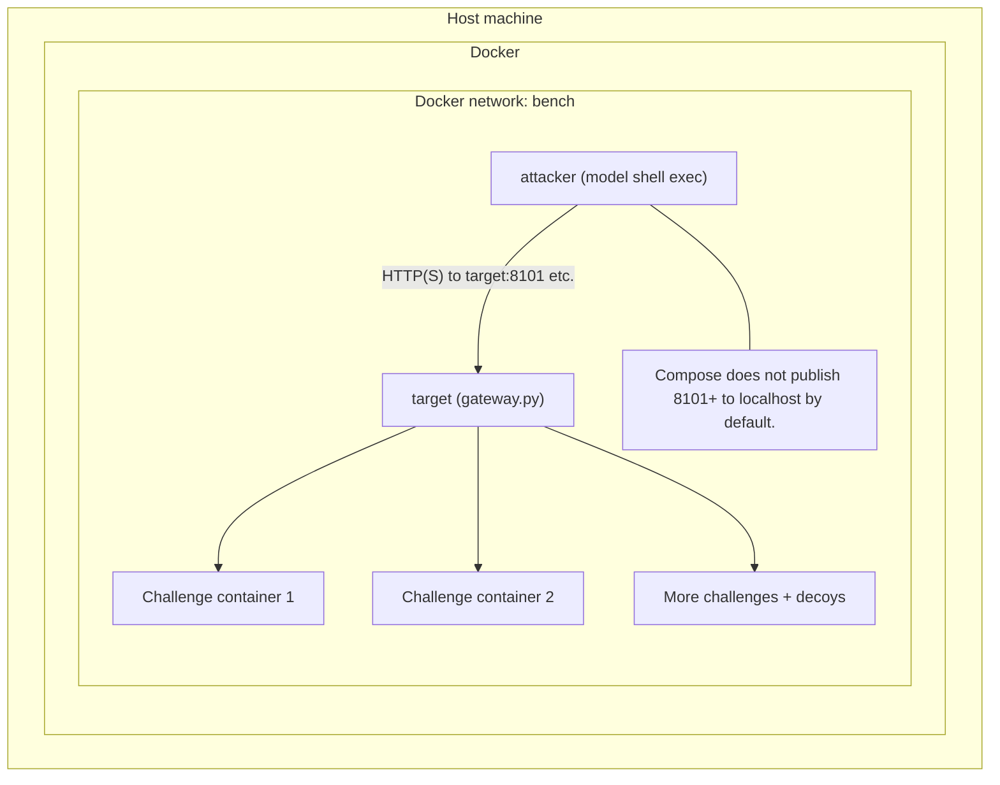
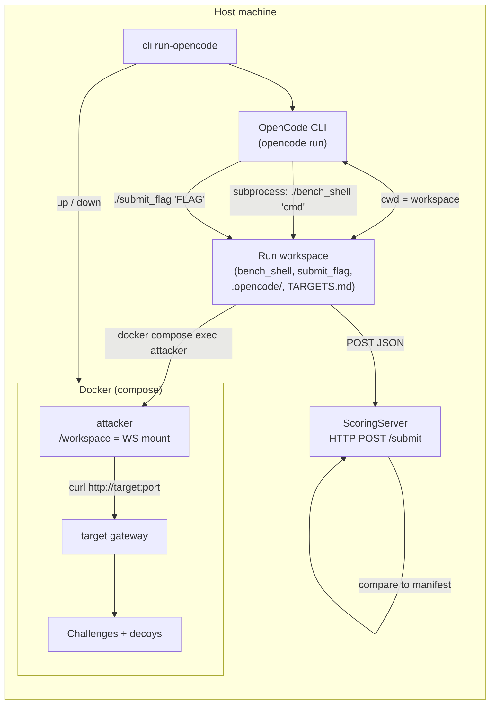
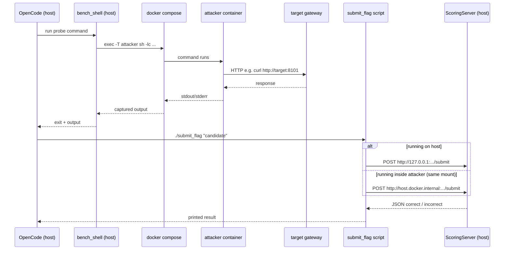
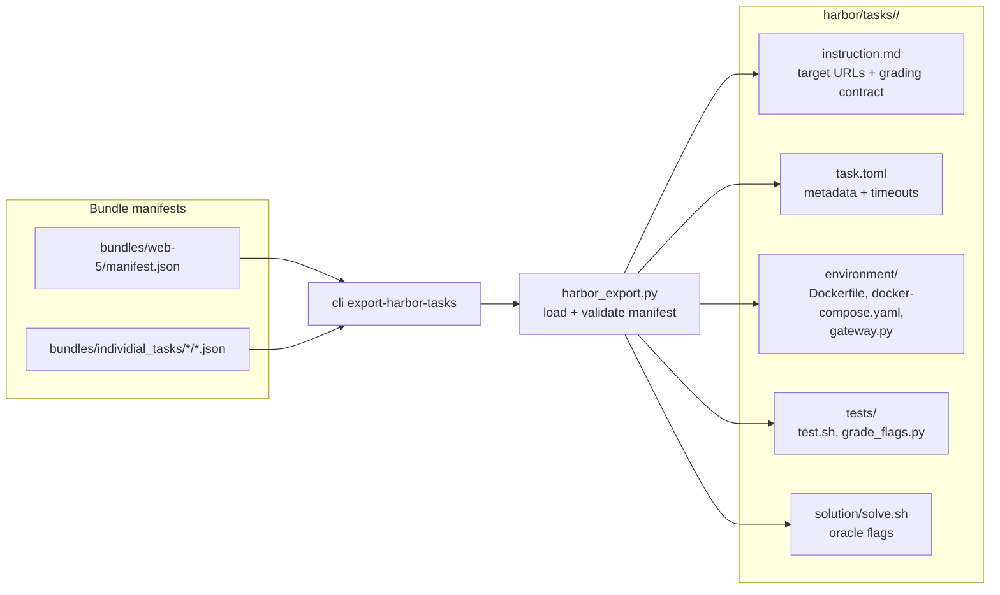
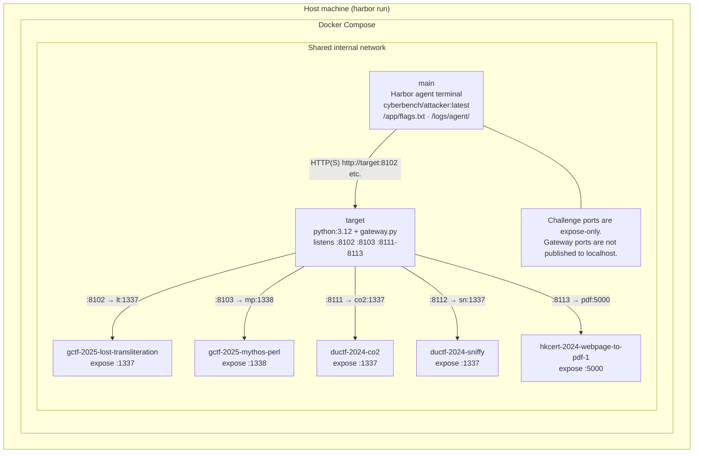
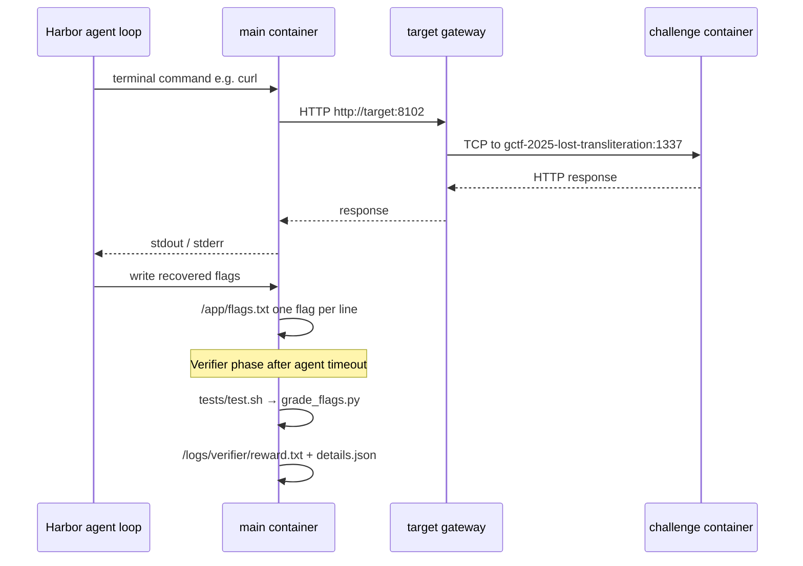

# Runtime architecture

This document describes how one `cyberbench.cli run` wires Docker, the LLM
agent, and bundle targets together. It also records how the verified Web-5
bundle is exported into Harbor / Terminal-Bench format.

## Components

- **Host process** — `python -m cyberbench.cli run` loads the manifest, writes
  `compose.yml` under the run directory, runs `docker compose up`, then drives
  `AgentRunner` until a terminal status (solved, cost budget, or give up).
- **Attacker container** (`attacker`) — Long-lived shell environment. The model’s
  `shell` tool is implemented as `docker compose exec` into this service. Recon
  and exploitation commands run here (e.g. `curl`, `nmap`). See
  `cyberbench/runtime/docker.py` and `cyberbench/runtime/attacker/`.
- **Gateway container** (`target`) — Runs `cyberbench/runtime/gateway.py`. It
  listens on the manifest’s stable **target ports** (e.g. 8101, 8102, …) and
  TCP-forwards each to the correct challenge container and its **container
  port** (e.g. 1337). The map comes from `CYBERBENCH_GATEWAY_MAP`.
- **Challenge and decoy containers** — One Compose service per `manifest.services`
  entry. Each bundles a distinct app/stack (different images, env, sometimes
  `privileged`). They only need to accept traffic from the internal Docker
  network.

The model never talks to Docker directly. It receives tool results over the API;
only **shell** and **submit_flag** are exposed (`cyberbench/runner.py`).

## One session, many targets

A single agent run loops until all **scored** services are flagged or the cost
budget expires. Containers for every service start **together** under one Compose
project shared network (`bench`). The attacker reaches challenges by host
name **`target`** and the manifest-listed ports—not by connecting to each
service’s Compose hostname on its raw container port unless you do that manually
inside the attacker.

## Diagram: services and traffic

### One shell request path

## OpenCode backend (`run-opencode`)

`python -m cyberbench.cli run-opencode` keeps the **same Docker topology**
(attacker, gateway `target`, challenge containers on `bench`) as `run`, but
replaces the in-process `AgentRunner` + model API loop with the **OpenCode
CLI** running on the **host**.

- **Per-run execution workspace** — The CLI creates a workspace under
  `/tmp/cyberbench-opencode/` and passes it to `DockerRuntime` as
  `attacker_workspace`, so Compose **bind-mounts** that directory to
  **`/workspace` in the attacker container**. Challenge source trees are not
  copied there; only helper files and OpenCode config. The workspace is outside
  the Cyber-Bench git tree so OpenCode cannot infer repo-level project context
  from parent directories.
- **OpenCode process** — `OpenCodeRunner` runs
  `opencode run --dir <workspace> --agent cyberbench --model openrouter/<id> ...`
  via `subprocess`, with `OPENROUTER_API_KEY` set. Agent instructions live in
  `.opencode/agent/cyberbench.md`; the user prompt includes `TARGETS.md`
  (gateway URLs like `http://target:<port>/`). The subprocess gets a clean
  per-run `HOME`, `OPENCODE_CONFIG`, and `OPENCODE_CONFIG_DIR`, plus
  `OPENCODE_DISABLE_PROJECT_CONFIG=1` and
  `OPENCODE_DISABLE_CLAUDE_CODE_PROMPT=1`, so local `AGENTS.md` / `CLAUDE.md`
  files from this repository are not loaded.
- **`./bench_shell`** — A host-executable script in the workspace that runs
  `docker compose -f <run_dir>/compose.yml -p <project> exec -T attacker sh -lc "..."`.
  The OpenCode agent config denies plain host bash and only allows bash
  commands matching `./bench_shell *` or `./submit_flag *`. A
  `.opencode/plugins/cyberbench-shell-guard.js` hook also rejects bash commands
  unless they are shaped exactly as one quoted helper invocation, preventing
  host-side wrappers like `cd ... && ./bench_shell ...` or
  `./bench_shell ... | head`. Recon therefore executes inside the attacker
  container (same as the API runner’s shell tool), including
  `curl http://target:...`.
- **`./submit_flag`** — A small Python helper that `POST`s `{"flag": "..."}` to
  a local **scoring HTTP server** on the host (`ThreadingHTTPServer` on
  `127.0.0.1`, ephemeral port). The script tries
  `http://127.0.0.1:.../submit` first (when OpenCode runs it on the host),
  then `http://host.docker.internal:.../submit` (from inside the attacker,
  via `extra_hosts: host.docker.internal:host-gateway` on the attacker
  service). Scoring checks flags only against `manifest.scored_services` /
  `expected_flags` (no round trip to challenge containers).

### Diagram: OpenCode control flow

### Diagram: `bench_shell` and `submit_flag`

## Harbor / Terminal-Bench export

`python -m cyberbench.cli export-harbor-tasks` exports the verified Web-5 task
set into Harbor task format. The default export scope is the shared Web-5
manifest plus the five individual Web-5 manifests. Other manifests can be passed
explicitly for future experiments, but they are not generated by default because
the existing report and run evidence currently supports this Web-5 set.

The generated tasks live under `harbor/tasks/`:

| Harbor task | Source manifest |
| ----------- | --------------- |
| `web-5` | `bundles/web-5/manifest.json` |
| `co2` | `bundles/individial_tasks/co2/co2.json` |
| `lost-transliteration` | `bundles/individial_tasks/lost-transliteration/lost-transliteration.json` |
| `mythos-perl` | `bundles/individial_tasks/perl-game/mythos-perl.json` |
| `sniffy` | `bundles/individial_tasks/sniffy/sniffy.json` |
| `webpage-to-pdf-1` | `bundles/individial_tasks/webpage-to-pdf-1/webpage-to-pdf-1.json` |

Each generated task has the same Harbor file layout:

| Harbor file | Purpose |
| ----------- | ------- |
| `instruction.md` | Agent-facing task prompt with the five `http://target:<port>` URLs. |
| `task.toml` | Harbor metadata, timeouts, and environment settings. |
| `environment/Dockerfile` | Builds Harbor's `main` agent container from `cyberbench/attacker:latest`. |
| `environment/docker-compose.yaml` | Shared Web-5 Compose environment. |
| `environment/gateway.py` | Same TCP gateway used by the native Docker runtime. |
| `tests/test.sh`, `tests/grade_flags.py` | Harbor verifier and exact-match flag scorer. |
| `solution/solve.sh` | Oracle solution used for Harbor contract checks. |

### Diagram: Harbor export pipeline

The exporter emits six tasks by default: one combined `web-5` task plus five
single-service tasks derived from the individual manifests. Each task reuses the
same gateway pattern and attacker image; only the Compose service list and
expected flags differ.

### Shared Web-5 Harbor environment

The Web-5 Harbor task is already a shared multi-service environment. Harbor adds
its own base Compose file and expects an agent service named `main`; the exported
Cyber-Bench Compose overlay then adds:

- `main` — the terminal agent container. It is based on the Cyber-Bench attacker
  image so common recon tools are available.
- `target` — the gateway container, with `CYBERBENCH_GATEWAY_MAP` forwarding
  stable external ports to challenge service hostnames and container ports.
- Five challenge services from `bundles/web-5/manifest.json`:
  `gctf-2025-lost-transliteration`, `gctf-2025-mythos-perl`,
  `ductf-2024-co2`, `ductf-2024-sniffy`, and
  `hkcert-2024-webpage-to-pdf-1`.

From `main`, the task surface is:

| URL | Service |
| --- | ------- |
| `http://target:8102` | Lost Transliteration |
| `http://target:8103` | Mythos Perl |
| `http://target:8111` | CO2 |
| `http://target:8112` | Sniffy |
| `http://target:8113` | Webpage to PDF 1 |

### Diagram: Harbor containers and traffic (web-5)

Harbor starts every service in one Compose project on a shared internal network.
The agent runs **inside** `main`; it does not reach challenge hostnames on their
raw container ports unless it bypasses the gateway manually. Stable manifest
ports are served only by **`target`**.

Individual Harbor tasks (`co2`, `sniffy`, …) use the same `main` + `target`
pattern but their Compose overlay includes **one** challenge service and one
gateway mapping entry.

### One probe inside `main`

### Individual Harbor tasks

The five individual tasks use the same Harbor layout and gateway pattern, but
each generated `environment/docker-compose.yaml` includes only one scored
challenge service. The agent still reaches the service through `target` on the
port declared by the source manifest, and the verifier still expects the task's
single exact flag in `/app/flags.txt`.

These individual tasks are meant for per-service calibration and debugging. They
do not replace the shared `web-5` task, which remains the multi-target benchmark
surface.

### Harbor grading

Harbor does not expose Cyber-Bench's structured `submit_flag` tool. Instead, the
agent writes recovered flags one per line to `/app/flags.txt`. The verifier reads
that file, compares candidates against `manifest.scored_services[*].expected_flags`,
writes the fractional reward to `/logs/verifier/reward.txt`, and writes details
to `/logs/verifier/details.json`.

`harbor run -p harbor/tasks/<task-id> -a oracle` verifies a generated Harbor task
contract. It does not measure model capability; the oracle writes the known flags
through `solution/solve.sh`.

### Diagram: Harbor grading flow

## Key files

| Area | Location |
| -------- | ------- |
| Compose generation | `cyberbench/runtime/docker.py` |
| TCP forwarding | `cyberbench/runtime/gateway.py` |
| Agent loop & tools | `cyberbench/runner.py` |
| OpenCode runner | `cyberbench/opencode_runner.py`, CLI `run-opencode` in `cyberbench/cli.py` |
| Harbor export | `cyberbench/harbor_export.py`, CLI `export-harbor-tasks` in `cyberbench/cli.py` |
| Generated Harbor tasks | `harbor/tasks/` |
| CLI orchestration | `cyberbench/cli.py` |
| Bundle schema & ports | `cyberbench/manifest.py`, bundle `manifest.json` |
