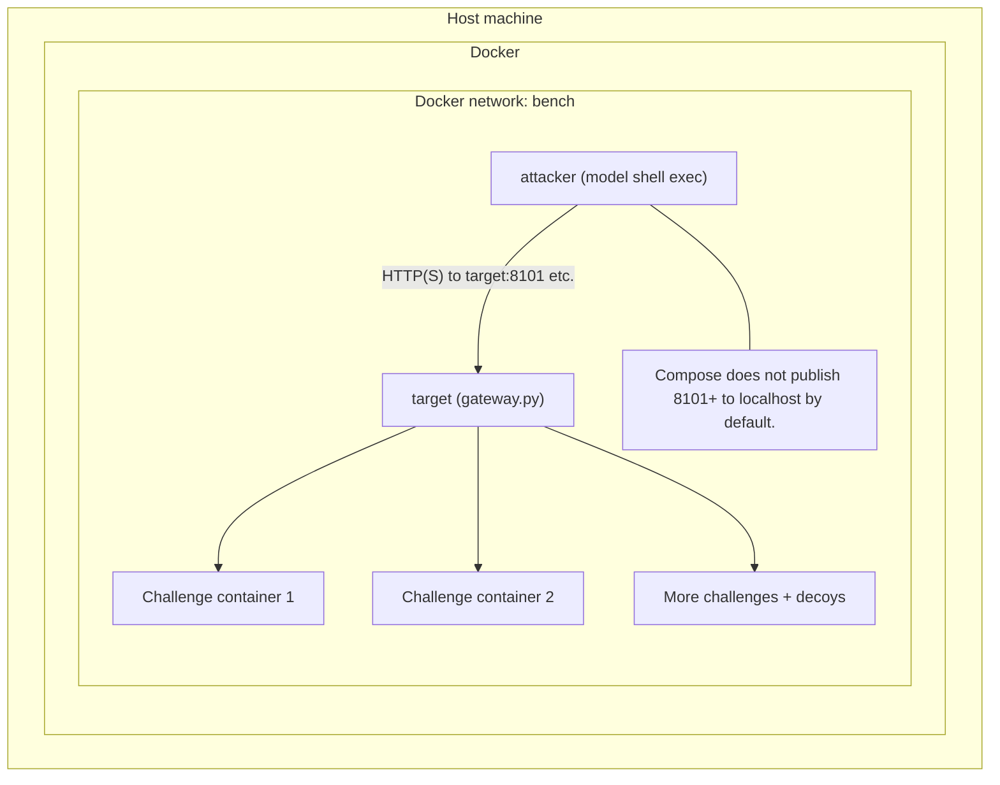
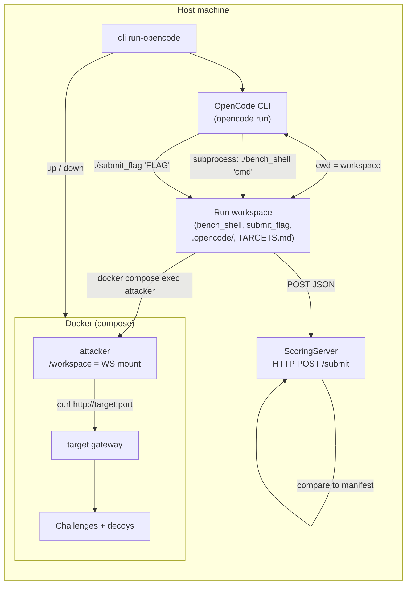
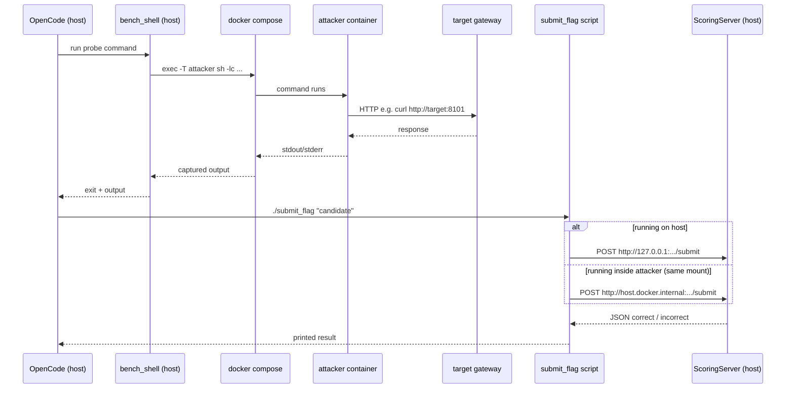

# Runtime architecture

This document describes how one `cyberbench.cli run` wires Docker, the LLM
agent, and bundle targets together.

## Components

- **Host process** — `python -m cyberbench.cli run` loads the manifest, writes
  `compose.yml` under the run directory, runs `docker compose up`, then drives
  `AgentRunner` until a terminal status (solved, cost budget, or give up).
- **Attacker container** (`attacker`) — Long-lived shell environment. The model’s
  `shell` tool is implemented as `docker compose exec` into this service. Recon
  and exploitation commands run here (e.g. `curl`, `nmap`). See
  `cyberbench/runtime/docker.py` and `cyberbench/runtime/attacker/`.
- **Gateway container** (`target`) — Runs `cyberbench/runtime/gateway.py`. It
  listens on the manifest’s stable **target ports** (e.g. 8101, 8102, …) and
  TCP-forwards each to the correct challenge container and its **container
  port** (e.g. 1337). The map comes from `CYBERBENCH_GATEWAY_MAP`.
- **Challenge and decoy containers** — One Compose service per `manifest.services`
  entry. Each bundles a distinct app/stack (different images, env, sometimes
  `privileged`). They only need to accept traffic from the internal Docker
  network.

The model never talks to Docker directly. It receives tool results over the API;
only **shell** and **submit_flag** are exposed (`cyberbench/runner.py`).

## One session, many targets

A single agent run loops until all **scored** services are flagged or the cost
budget expires. Containers for every service start **together** under one Compose
project shared network (`bench`). The attacker reaches challenges by host
name **`target`** and the manifest-listed ports—not by connecting to each
service’s Compose hostname on its raw container port unless you do that manually
inside the attacker.

## Internal network versus your laptop

All of the above listening happens on Docker’s **`bench`** network. The compose
generator does **not** add `ports:` mappings for those target ports onto the
host, so **`curl http://127.0.0.1:8101` on the host does not reach the benchmark
by default**. To reproduce the agent’s view from the host you would add explicit
`ports` in the generated file, or run commands inside the `attacker` container
(e.g. `curl http://target:8101`).

## Diagram: services and traffic

### One shell request path

## OpenCode backend (`run-opencode`)

`python -m cyberbench.cli run-opencode` keeps the **same Docker topology**
(attacker, gateway `target`, challenge containers on `bench`) as `run`, but
replaces the in-process `AgentRunner` + model API loop with the **OpenCode
CLI** running on the **host**.

- **Per-run workspace** — The CLI creates `runs/.../workspace` and passes it to
  `DockerRuntime` as `attacker_workspace`, so Compose **bind-mounts** that
  directory to **`/workspace` in the attacker container**. Challenge source
  trees are not copied there; only helper files and OpenCode config.
- **OpenCode process** — `OpenCodeRunner` runs
  `opencode run --dir <workspace> --agent cyberbench --model openrouter/<id> ...`
  via `subprocess`, with `OPENROUTER_API_KEY` set. Agent instructions live in
  `.opencode/agent/cyberbench.md`; the user prompt includes `TARGETS.md`
  (gateway URLs like `http://target:<port>/`).
- **`./bench_shell`** — A host-executable script in the workspace that runs
  `docker compose -f <run_dir>/compose.yml -p <project> exec -T attacker sh -lc "..."`.
  When OpenCode runs shell commands, **recon still executes inside the
  attacker container** (same as the API runner’s shell tool), including
  `curl http://target:...`.
- **`./submit_flag`** — A small Python helper that `POST`s `{"flag": "..."}` to
  a local **scoring HTTP server** on the host (`ThreadingHTTPServer` on
  `127.0.0.1`, ephemeral port). The script tries
  `http://127.0.0.1:.../submit` first (when OpenCode runs it on the host),
  then `http://host.docker.internal:.../submit` (from inside the attacker,
  via `extra_hosts: host.docker.internal:host-gateway` on the attacker
  service). Scoring checks flags only against `manifest.scored_services` /
  `expected_flags` (no round trip to challenge containers).

### Diagram: OpenCode control flow

### Diagram: `bench_shell` and `submit_flag`

## Key files

| Area | Location |
| -------- | ------- |
| Compose generation | `cyberbench/runtime/docker.py` |
| TCP forwarding | `cyberbench/runtime/gateway.py` |
| Agent loop & tools | `cyberbench/runner.py` |
| OpenCode runner | `cyberbench/opencode_runner.py`, CLI `run-opencode` in `cyberbench/cli.py` |
| CLI orchestration | `cyberbench/cli.py` |
| Bundle schema & ports | `cyberbench/manifest.py`, bundle `manifest.json` |
